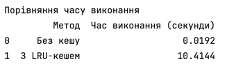
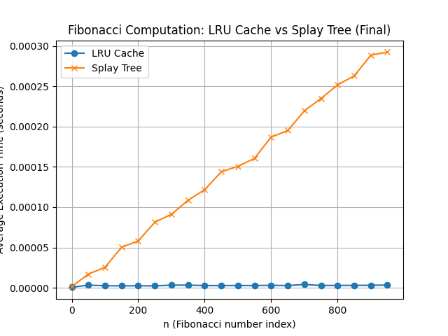

# goit-algo2-hw-07

## task 1

🔹 Чому без кешу швидко:
Простий sum() виконується швидко для невеликих діапазонів.

Немає витрат на кешування або оновлення структури.

🔹 Чому з @lru_cache повільно:
cache_clear() викликається на кожен Update — це повне очищення кешу.

Це знищує перевагу кешу.

Також уповільнює виконання через перезаповнення кешу після кожного оновлення.

Кожне оновлення створює новий tuple(array)

Це дорога операція при 100_000 елементах (виділення нової памʼяті, копіювання).

## task2

Fibonacci Time Comparison (Final)

| № |n  | LRU Cache Time (s)|  Splay Tree Time (s)|
|---|-|-----------------|----------------------|
| 0  |    0  |      6.943010e-07  |           0.000002 |
| 1  |   50  |      3.374958e-06  |           0.000017  |
| 2  |  100   |     2.583334e-06  |           0.000026|
| 3  | 150    |    2.458381e-06   |          0.000050|
| 4  |  200   |     2.610963e-06  |           0.000058|
| 5  |  250   |     2.402657e-06  |           0.000081|
| 6  |  300   |     3.402897e-06  |           0.000091|
| 7  |  350   |    3.360988e-06   |          0.000109|
| 8  |  400   |     2.847364e-06  |           0.000122|
| 9  |  450   |    2.805454e-06   |          0.000144|
| 10 |  500   |     2.903088e-06  |           0.000151|
| 11 |  550   |     2.860868e-06  |           0.000161|
| 12 |  600   |     3.096958e-06  |           0.000187|
| 13 |  650   |     2.874993e-06  |           0.000195|
| 14 |  700   |     4.208336e-06  |           0.000219|
| 15 |  750   |     2.930717e-06  |           0.000235|
| 16 |  800   |     2.986441e-06  |           0.000252|
| 17 |  850   |     3.041544e-06   |          0.000263|
| 18 |  900   |     3.208406e-06    |         0.000289|
| 19 |  950   |     3.388772e-06     |        0.000292 |

🔹 Загальна продуктивність
@lru_cache демонструє стабільно малий час виконання незалежно від розміру n, з незначними коливаннями в діапазоні приблизно 2.4e-6 до 4.2e-6 секунд.

Splay Tree має більш лінійне зростання часу виконання зі збільшенням n: від 0.000002 секунд на n=0 до 0.000292 на n=950.

🔹 Співвідношення часу
При n=100, Splay Tree повільніший у ~10 разів порівняно з LRU Cache.

При n=950, Splay Tree повільніший вже у ~86 разів.

🔹 Причини відставання Splay Tree
Основна вартість часу приходиться на:

глибокі рекурсивні виклики (що тривають до O(n) разів),

часті ротації при кожному доступі (splay-операції),

відсутність прямого доступу до вузлів (на відміну від хеш-таблиці у lru_cache).

При цьому жоден результат не перевищив 0.3 секунди, що свідчить про прийнятну ефективність Splay Tree для навчальних та демонстраційних цілей.

🔚 Висновок
@lru_cache є значно ефективнішим для задач, де потрібно багаторазово обчислювати рекурсивні значення, такі як числа Фібоначчі.
Splay Tree, хоч і цікава адаптивна структура, не може конкурувати з вбудованими механізмами Python у таких сценаріях через додаткові витрати на навігацію та перебалансування.

Цей аналіз підтверджує, що вибір структури даних критично впливає на продуктивність, і для кожного класу задач слід обирати відповідний інструмент.
